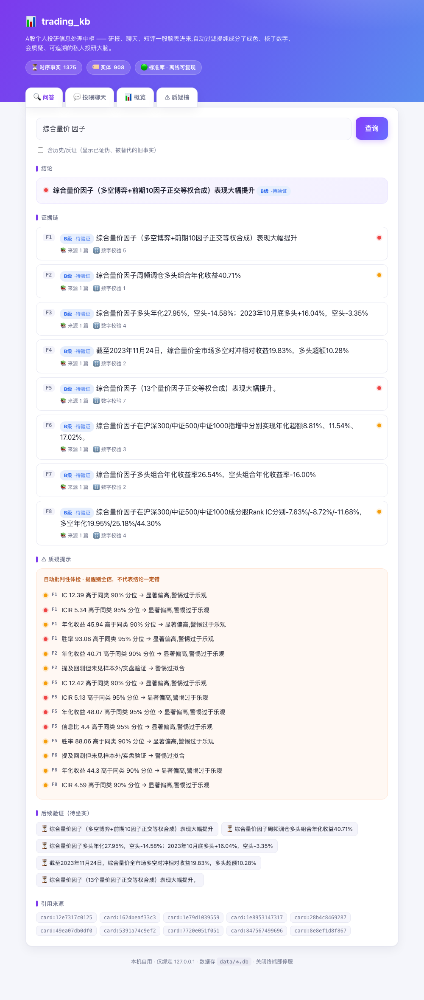

<div align="center">

# 📊 trading_kb

**A股个人投研信息处理中枢**

把研报、聊天、短评……各类投研信息，统一**过滤提纯**成"分了成色、核了数字、可追溯、不健忘"的私人投研大脑。


</div>

---

> 一句话：你把各种投研信息一股脑丢进去，它自动**从噪声里提纯**出有价值的结论，标好可信度成色、核对每个数字、还会**质疑过于乐观的说法并联网拉公告求证**；之后随口一问，给你一份带证据、带出处、带成色的六段式回答。

## ✨ 它不一样的地方

- 🧪 **不会编数字** — 研报里每个数字回原文核对，AI 编的当场标红
- 🎚️ **给证据分成色** — A 公告 / B 研报 / C 专家 / D 群聊，治"把小作文当买点"
- 🔍 **会质疑，不只会总结** — 自动揪出没出处的猜测、过于乐观的数字（同类分位对照）、回测软肋
- 🌐 **联网只采信权威** — 公告直接走巨潮（免费无额度）+ 上交所兜底，自媒体不采信
- 🔁 **深度求证闭环** — 可疑说法自动拉对应公告正文核对口径（佐证/打脸/无披露）
- 🗂️ **什么信息都能吃** — 研报走重质量通道，聊天碎片走轻舆情通道，噪声不淹没证据

## 🖥️ 长这样（真实输出）

```text
$ ./tkb ask "综合量价 因子"

## 结论
综合量价因子（多空博弈+前期10因子正交等权合成）表现大幅提升 [B级·待验证]

## 证据链
[F1] [B级·待验证]🔴 综合量价因子…表现大幅提升   (来源1篇, 数字校验5)
[F2] [B级·待验证]🟠 综合量价因子周频调仓多头组合年化收益40.71%   (来源1篇, 数字校验1)
...

## ⚠ 质疑提示
（自动批判性体检，提醒别全信；不代表结论一定错）
- 🔴 [F1] ICIR 5.34 高于同类 95% 分位 → 显著偏高,警惕过于乐观
- 🔴 [F1] 胜率 93.08 高于同类 95% 分位 → 显著偏高,警惕过于乐观
- 🟠 [F2] 年化收益 40.71 高于同类 90% 分位 → 显著偏高,警惕过于乐观
```

## 🖥️ Web 控制台（推荐）

```bash
./tkb web        # 浏览器打开 http://127.0.0.1:8765，问答 / 投喂 / 概览 / 质疑榜
```

一个页面把四件事都做了，问答结果带成色徽章和质疑标记彩色渲染；纯标准库、零新依赖、仅绑本机。

<p align="center">
  
</p>

## 🚀 命令行：怎么把信息丢进去

```bash
cd trading_kb

# 研报 PDF：一条龙（抽卡 + 数字校验 + 入三层库）
./tkb add ~/Downloads/某券商机器人深度          # 文件或整个文件夹都行

# 聊天记录 / 短评：一行一条的 txt（行首可带时间戳）
./tkb feed-chat 群聊摘录.txt                    # 默认按已入库股票池过滤
./tkb feed-chat 群聊摘录.txt --watch "绿的谐波,宁德时代"

# 已有 report_lab 卡片，直接入库
./tkb ingest
```

然后随便问 / 看质疑：

```bash
./tkb ask "多空因子 选股效果"        # 提问，得到六段式回答
./tkb critique                    # 看最该质疑的结论
```

> 详细用法见 [使用说明.md](使用说明.md)；完整项目说明见 [项目说明_完整版.md](项目说明_完整版.md)。

## 🔌 数据从哪进来（内容获取在框架之外）

本仓库是**框架**：三层知识库的入库 / 分级 / 质疑 / 问答。**内容获取**（券商研报下载、
社媒抓取、公告抓取等）**不在本仓库内**——它们是各自独立的数据源工具，产物统一落成
**卡片 JSON**，再由 `./tkb ingest` 读取入库。

- **接入点 = 卡片 JSON**：schema 见 `src/trading_kb/report_lab_adapter.py` 的
  `card_to_findings`（关键字段：`type / date / broker / findings[claim, evidence, numbers,
  entities, confidence]`）。写个抓取器把任意来源抽成卡片 JSON → 放进 `cards/` →
  `./tkb ingest`。框架不关心卡片从哪来。
- **可选 LLM 增强**（`USE_LLM=1`：A 类智能分流 + 答案合成）走 `src/trading_kb/llm.py`，
  需自备 `~/.config/{kimi,deepseek}/api_key`。**本仓库不含任何密钥 / token**。

---

按 `design_final.md (v2.2)` 落地的可运行实现。复用 report_lab 的 extract+verify 护城河,
在其上补**时序事实层 + 结构关系层 + 双轨成色 + 双通道摄入**。

## 设计映射(代码 ↔ 设计文档)

| 模块 | 设计章节 | 生产可平替 |
|---|---|---|
| `report_lab_adapter` | §6 复用 | report_lab(已有) |
| `classify` 分流器 | §7.3 + 量化扩展 | LLM 复判钩子 |
| `grade` 双轨成色 | §10.1 / §19 | — |
| `web_enrich` / `announcement` 联网核实 | §8 / §19 | 公告**已实测接通**:巨潮cninfo(免费无额度,沪深全量)+orgId精确查询+18大类分类+PDF正文提取+上交所兜底+退避重试;tdx无公告/不接hibor/智能选股4000月不用于公告 |
| `facts_store` 时序事实 | §18 / §10.3 | **Graphiti** |
| `structure_store` 结构图 | §18 F6 | **LightRAG** |
| `entity_registry` 实体归一 | §17 | tdx 代码表 |
| `sentiment_lane` 舆情轻lane | §10-bis | — |
| `ask` 六段式 | §11 | — |

> 重后端(Graphiti/LightRAG/RAGFlow/MinerU)在本实现里用 SQLite 忠实实现其**语义**,
> 保证整套可离线运行与测试;上线时按设计平替为对应成熟件即可,接口不变。

## 设计立场(为何这样实现)

- **确定性核心 + LLM 钩子**:`classify`/`grade` 默认走规则核心,可复现、可测试;
  `TKB_USE_LLM=1` 启用 LLM 复判。
- **查不到 ≠ 证伪**(§3 铁律5):`grade` 对不可验证类保留信源基线 + `unverifiable`。
- **证伪不删除**(§16.1):`facts_store.contradict/supersede` 只置 `invalid_at`,可 `include_invalidated` 查回。
- **双通道隔离**(§10-bis):舆情走 `sentiment_lane`,默认 D 级、不进研报证据链,印证才升级。

## 用法

```bash
cd ~/trading_kb

# 跑测试
python -m pytest -q            # 或 python run_tests.py(无 pytest 时)

# 研报重 lane:摄入 report_lab 已有卡片
python -m trading_kb.cli ingest                 # 需先 cd src 或装包,见下

# 三层规模
python -m trading_kb.cli stats

# 六段式问答
python -m trading_kb.cli ask "绿的谐波 定点"

# 舆情轻 lane 演示
python -m trading_kb.cli sentiment-demo
```

运行 CLI 前确保 `src` 在 path:`PYTHONPATH=src python -m trading_kb.cli ...`。

## 数据

- 输入:`~/report_lab/cards/*.json`(已有 63 篇研报)
- 输出:`data/{facts,structure,entities,sentiment}.db`

## 已知边界(诚实记录,经两轮 agent 审查+模拟验证)

- **语料决定能力上限**:本地 62/63 为量化研报,硬事实(订单/产能)仅 ~5 条,产业链结构关系实测 **0 条**。`structure_store`(LightRAG 等价层)与"多源印证升级成色"在当前量化语料下基本空转——这是**语料缺口,非代码 bug**。灌入行业/公司研报后即可激活。
- **去重粒度**:事实 `object=claim[:80]`,故 dedup 近似"精确 claim 匹配",不同措辞的同一论断当前不合并(`support_count` 多为 1)。生产可换语义相似度合并。
- **结论排序**:六段式"结论"取最相关项,**暂不理解"最高/最低"等数值语义**(B3),复杂排序需 LLM 介入。
- **LLM 钩子**:`classify/grade` 默认规则核心(可复现)。`config.USE_LLM` 仅为意图标志;真实 LLM 分类器需调用方给 `run_ingest(llm_classify=...)` 注入(尚未默认接 report_lab 模型链)。
- **数据验证**:`verify_hooks` 默认安全桩(不实查);启用需 `TKB_USE_DATA_VERIFY=1` 且接好数据源(§23.1 事件驱动控额度)。
- **实体归一**:卡片 code 覆盖率约 16%,无 code 的股票落 `stock_pending:`,可后续 tdx 补齐/合并。

## 审查与修复轨迹

经两个独立 agent 把关:
1. **代码审查 agent**:查需求-实现一致性,发现 supersede 自碰撞数据丢失、状态机未接管线、市场代码路由错等;已全部修复并加回归测试。
2. **模拟实验 agent**:用真实 63 篇端到端跑,发现非 dict 卡片崩溃、并发崩溃、基金/ETF 错挂、召回坍缩、中文无空格零召回等;已修复 A1/A2/A3/A4/B1/B2/B4/C4/C5 等并补测试。

当前:**45 测试全绿**(含真实语料不变量),崩溃路径全部加固,可作内部 MVP 试用。
